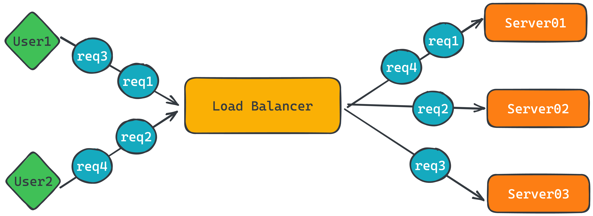
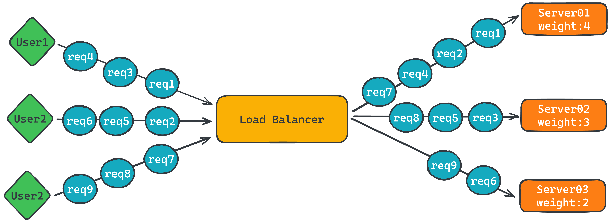

# loadbalancer-algorithms

A load balancing algorithm is a computational method that distributes workloads across multiple computing resources in a network, such as servers, to optimize resource utilization and improve performance. The goal of a load balancing algorithm is to ensure that no single resource is overburdened while others remain underutilized, which can lead to inefficient use of resources and reduced performance.

Load balancing algorithms typically use a set of rules or metrics to determine which resource to assign a task to. For example, a simple round-robin algorithm might assign each task to the next available resource in a list, while a more sophisticated algorithm might take into account factors such as the current workload of each resource, the available memory and processing power of each resource, and the network latency between the resources and the requesting client.

Some common types of load balancing algorithms include:

* Round-robin: Assigns tasks in a circular order to each available resource.
* Least connections: Assigns tasks to the resource with the fewest active connections.
* IP hash: Assigns tasks based on a hash of the client's IP address.
* Weighted round-robin: Assigns tasks to resources based on a predetermined weighting value.
Load balancing algorithms are commonly used in large-scale distributed computing systems, such as web servers, cloud computing environments, and content delivery networks (CDNs).

## Static load balancing algorithms

* Round robin
* Weighted round robin
* IP hash

### Round Robin

Round robin is a scheduling algorithm used in computing systems to manage the allocation of resources among processes or tasks. It is a pre-emptive algorithm that assigns a fixed time slice, known as a time quantum, to each process in a cyclic manner.

The basic idea of the round robin algorithm is to ensure that no process or task monopolizes the CPU, and that each process gets an equal share of CPU time. In this algorithm, each process is assigned a time quantum, which is usually a small fraction of a second. The processes are executed in a circular order, and when a process has exhausted its time quantum, it is suspended and moved to the end of the queue. The next process in the queue is then executed.

The round robin algorithm is simple and easy to implement, and it ensures fairness in the allocation of resources. However, it may not be the most efficient scheduling algorithm for all situations, as some processes may require more time than others to complete their tasks. In such cases, a priority-based scheduling algorithm may be more appropriate.



See the following example.

```go
package main

import (
  "fmt"
  "net/url"

  "github.com/appleboy/loadbalancer-algorithms/roundrobin"
)

func main() {
  servers := []*url.URL{
    {Host: "192.168.1.10"},
    {Host: "192.168.1.11"},
    {Host: "192.168.1.12"},
    {Host: "192.168.1.13"},
  }

  rb, err := roundrobin.New(servers...)
  if err != nil {
    panic(err)
  }

  fmt.Println(rb.NextServer().Host)
  fmt.Println(rb.NextServer().Host)
  fmt.Println(rb.NextServer().Host)
  fmt.Println(rb.NextServer().Host)
  fmt.Println(rb.NextServer().Host)
}
```

output as following

```sh
192.168.1.10
192.168.1.11
192.168.1.12
192.168.1.13
192.168.1.10
```

### Weighted Round Robin

In the context of load balancing, weighted round-robin is a scheduling algorithm used to distribute incoming traffic across a group of servers in a data center or network. In this algorithm, each server is assigned a "weight" value, which is a relative measure of its capacity or processing power.

When a request comes in, the load balancer cycles through the available servers in a circular order, processing each request on a selected server for a fixed amount of time before moving on to the next server in the cycle. The number of requests that are sent to each server is proportional to its weight value. For example, if one server has a weight of 2 and another has a weight of 1, the first server will receive twice as many requests as the second server.

Weighted round-robin load balancing can be useful when servers have different processing capabilities or when some servers need to handle a larger share of the incoming traffic. By assigning weights to each server, the load balancer can distribute requests in a way that optimizes the use of available resources and ensures that no single server is overwhelmed by traffic.

reference to [Weighted Round-Robin Scheduling](http://kb.linuxvirtualserver.org/wiki/Weighted_Round-Robin_Scheduling).

For example, the real servers, **A, B and C**, have the weights, **4, 3, 2** respectively, a scheduling sequence will be `AABABCABC` in a scheduling period.



See the following example.

```go
package main

import (
  "fmt"
  "net/url"

  "github.com/appleboy/loadbalancer-algorithms/weighted"
)

type server struct {
  url    *url.URL
  weight int
}

func main() {
  servers := []*server{
    {
      url: &url.URL{
        Host: "192.168.1.10",
      },
      weight: 4,
    },
    {
      url: &url.URL{
        Host: "192.168.1.11",
      },
      weight: 3,
    },
    {
      url: &url.URL{
        Host: "192.168.1.12",
      },
      weight: 2,
    },
  }

  rb, err := weighted.New()
  if err != nil {
    panic(err)
  }

  for _, v := range servers {
    _ = rb.AddServer(v.url, v.weight)
  }

  fmt.Println(rb.NextServer().Host)
  fmt.Println(rb.NextServer().Host)
  fmt.Println(rb.NextServer().Host)
  fmt.Println(rb.NextServer().Host)
  fmt.Println(rb.NextServer().Host)
  fmt.Println(rb.NextServer().Host)
  fmt.Println(rb.NextServer().Host)
  fmt.Println(rb.NextServer().Host)
  fmt.Println(rb.NextServer().Host)
}
```

output as following

```sh
192.168.1.10
192.168.1.10
192.168.1.11
192.168.1.10
192.168.1.11
192.168.1.12
192.168.1.10
192.168.1.11
192.168.1.12
```
